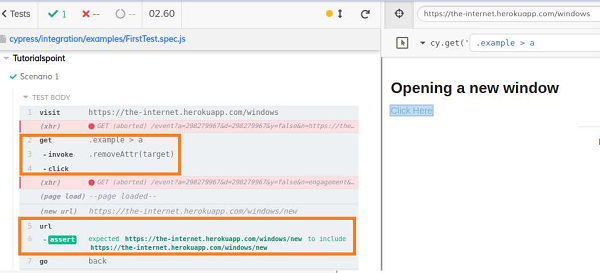
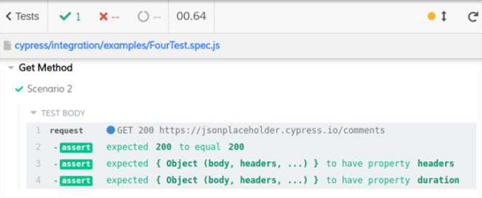
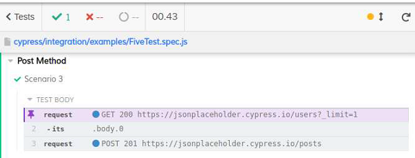
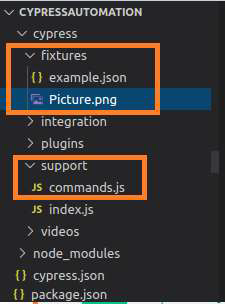
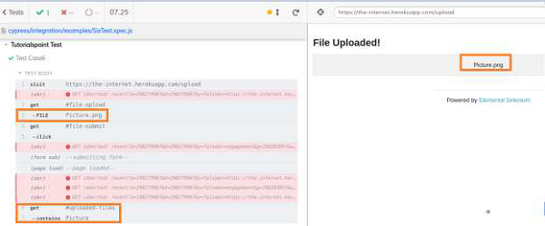

# Cypress básico

> Agumas funções utilizadas pelo Cypress tem sua origem do Mocha

- `.describe()`: define um grupo de testes
- `.it()`: define um teste

## Asserts

- `expect(a).to.be.equal(b))`
  - o `.to.be` pode ser abstraído
  - `expect(a).equal(b)`

### True/False/Null

- `expect(a).to.be.true`;
- `expect(true).to.be.true`
- `expect(b).to.be.null`
- `expect(c).to.be.undefined`

## Tabelas

> Exemplo: Encontrar uma linha com uma célula específica e confirmar outras células na linha

```html
<table>
  <tr>
    <td>Meu primeiro cliente</td>
    <td>Meu primeiro projeto</td>
    <td>0</td>
    <td>Ativo</td>
    <td><button>Editar</button></td>
  </tr>
</table>
```

```javascript
cy.contains('Meu primeiro cliente')
  .parent('tr')
  .within(() => {
    // Todas as buscas são automaticamente focadas no elemento tr encontrado
    cy.get('td').eq(1).contains('Meu primeiro projeto')
    cy.get('td').eq(2).contains('0')
    cy.get('td').eq(3).contains('Ativo')
    cy.get('td').eq(4).contains('button', 'Editar').click()
  })
```

> Para obter um índice específico de um elemento DOM, usamos o comando `.eq()`

## Child Windows

Cypress não tem um comando específico para trabalhar com child windows. Ele tem um método de solução alternativa no jQuery através do qual manipula as janelas filhas.

- No código html, um link ou botão abre para uma janela filha, devido ao atributo target.
- Se o atributo de destino tiver o valor em branco, ele será aberto em uma janela filho.
- Cypress usa o método removeAttr do jQuery, que é invocado pelo comando invoke no Cypress.
- O removeAttr exclui o atributo, que é passado como um dos parâmetros para o método invoke.
- Depois que o target=blank for removido, um link/botão é aberto na janela pai e, após realizar as operações, podemos voltar para a URL pai com o comando go.

código HTML:

```HTML
<h3>Opening a new window</h3>
<a href="/windows/new", ="" target="_blank">Click here</a>
```

### Implementação

```javascript
describe('Tutorialspoint', function () {
   // test case
   it('Scenario 1', function (){
      // url launch
      cy.visit("https://the-internet.herokuapp.com/windows")
      // delete target attribute with invoke for link
      cy.get('.example > a')
      .invoke('removeAttr', 'target').click()
      // verify child window url
      cy.url()
      .should('include', 'https://the-internet.herokuapp.com/windows/new')
      // shift to parent window
      cy.go('back');
   });
});
```

#### Resultado



## Elementos HTTP

### Cookies

Cypress lida com cookies com os métodos `Cookies.preserveOnce()` e `Cookies.defaults()` . O método `Cookies.debug()` produz logs no console, caso haja alguma alteração nos cookies.

Por padrão, o Cypress remove todos os cookies antes de cada execução de teste. Podemos utilizar `Cypress.Cookies.preserveOnce()` para preservar os cookies com seus nomes para serem usados ​​em outros testes.

> Em uma versão futura, o suporte para `Cypress.Cookies.preserveOnce()` e `Cypress.Cookies.defaults()` será removido. Considere usar o [`cy.session()`](https://docs.cypress.io/api/commands/session) comando experimental em vez de armazenar em cache e restaurar cookies e outros detalhes de sessões entre os testes.

Ler mais sobre as funções [aqui](https://www.tutorialspoint.com/cypress/cypress_cookies.htm).

### Get / Post

Os métodos Get e Post fazem parte do teste da Application Programming Interface (API), que pode ser realizado pelo Cypress.

#### Get

Para realizar uma operação Get, devemos fazer uma requisição HTTP com o cy.request() e passar o método Get e URL como parâmetros para aquele método.

O código de status reflete se a solicitação foi aceita e tratada corretamente. O código 200(significa ok) e 201(significa criado).

```javascript
describe("Get Method", function(){
   it("Scenario 2", function(){
      cy.request("GET", "https://jsonplaceholder.cypress.io/comments", {
      }).then((r) => {
         expect(r.status).to.eq(200)
         expect(r).to.have.property('headers')
         expect(r).to.have.property('duration')
      });
   })
})
```

##### Resultado




#### Post

Ao usar o método Post, na verdade estamos enviando informações. Se tivermos um grupo de entidades, podemos acrescentar novas no final, com a ajuda de Post.

Para realizar uma operação Post, devemos fazer uma requisição HTTP com o cy.request() e passar o método Post e URL como parâmetros para aquele método.

```javascript
describe("Post Method", function(){
   it("Scenario 3", function(){
        cy.request('https://jsonplaceholder.cypress.io/users?_limit=1')
        .its('body.0') // yields the first element of the returned list
        // make a new post on behalf of the user
        cy.request('POST', 'https://jsonplaceholder.cypress.io/posts', {
            title: 'Cypress',
            body: 'Automation Tool',
        })
   })
});
```

##### Resultado



### File upload

Para executar a tarefa de upload de arquivos no Cypress, primeiro temos que instalar um plugin com o comando abaixo

`npm install –dev cypress-file-upload`

- Uma vez que a instalação é feita, temos que adicionar a instrução import 'cypress-file-upload' no arquivo command.js. 
  - Este arquivo reside dentro da pasta de suporte em nosso projeto Cypress.
- Além disso, adicionaremos o arquivo que desejamos carregar dentro da pasta de fixtures (arquivo Picture.png).



Para fazer upload de um arquivo, temos que usar o comando Cypress, `attachFile()` e passar o caminho do arquivo a ser carregado como parâmetro.

```javascript
describe('Tutorialspoint Test', function () {
    // test case
    it('Test Case6', function (){
        //file to be uploaded path in project folder
        const p = 'Picture.png'
        // launch URL
        cy.visit("https://the-internet.herokuapp.com/upload")
        //upload file with attachFile
        cy.get('#file-upload').attachFile(p)
        //click on upload
        cy.get('#file-submit').click()
        //verify uploaded file
        cy.get('#uploaded-files').contains('Picture')
    });
});
```

##### Resultado



Os logs de execução mostram que o arquivo Picture.png foi carregado e o nome do arquivo foi refletido na página.

---

- [x] iframe vs frame
- [x] Tabelas
- [x] Child Windows
- [x] Elementos HTTP (cookies, GET, POST, file upload)
- [ ] Request
