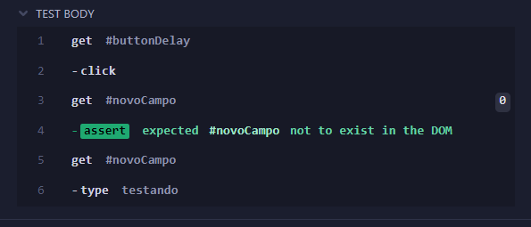

- [Sincronismo](#sincronismo)

# Sincronismo

Até certo ponto, o Cypress lida com esperas de forma automática. 

**Exemplo:**
Dentro do [wcaquino](https://wcaquino.me/cypress/componentes.html), existe um botão que cria um novo campo de texto após alguns segundos.

> Em outros frameworks, para digitarmos algo nesse novo campo de texto precisaríamos de alguma forma fazer a ferramenta esperar pelo surgimento desse novo elemento.

O Cypress possui uma espécie de *auto wait* que espera alguns segundos pelo surgimento de algum elemento no DOM.

```javascript
it('espera lenta', () => {
    cy.get('#buttonDelay').click()
    cy.get('#novoCampo').should('not.exist')
    cy.get('#novoCampo').type('testando')
})
```

1. Localizamos o botão que vai gerar o campo de texto com delay e clicamos.
2. Fazemos um assert para garantir que o campo de texto de fato ainda não existe.
3. Tentamos digitar no campo e, então, o cypress espera até que ele exista no DOM

